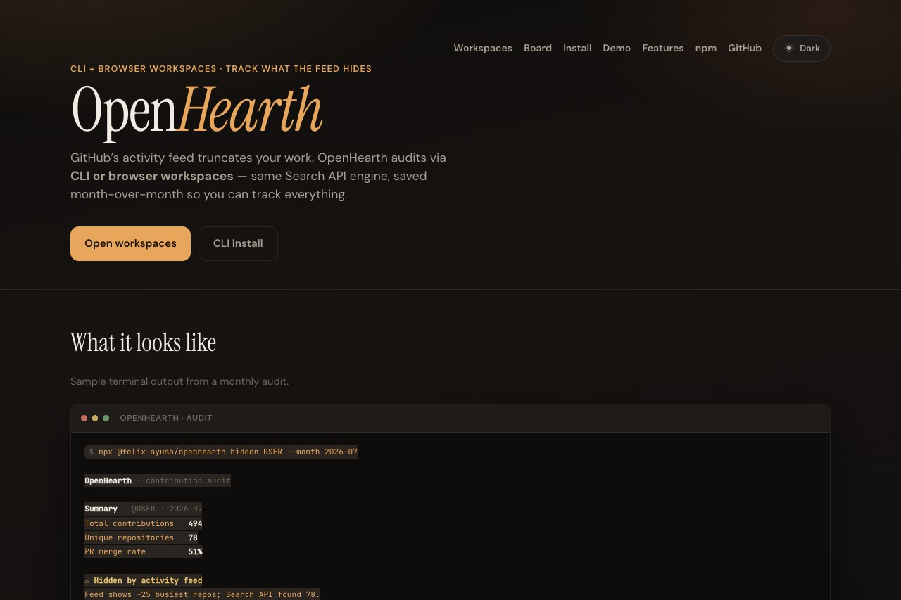
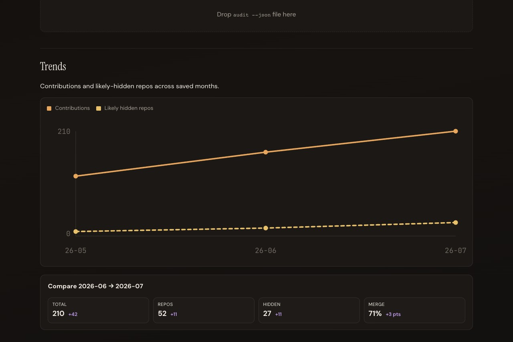
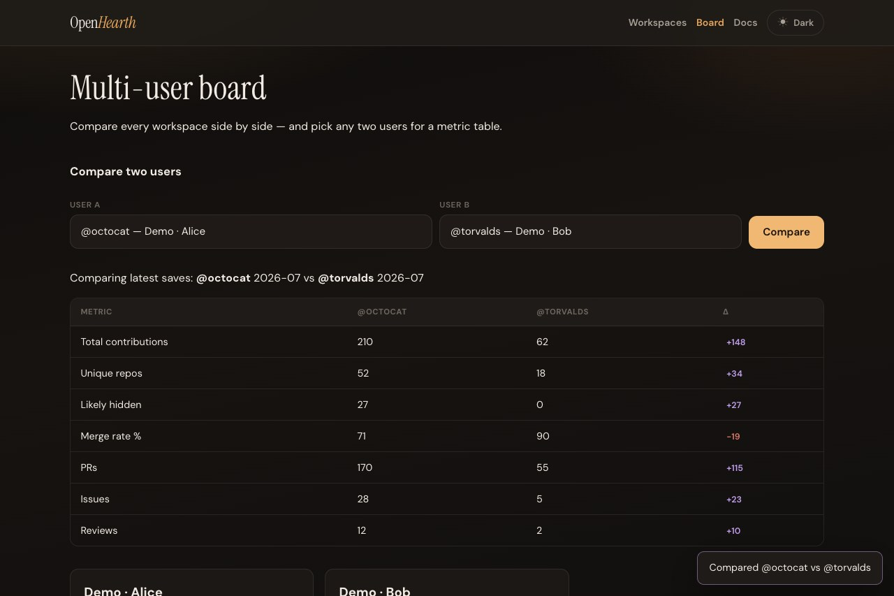
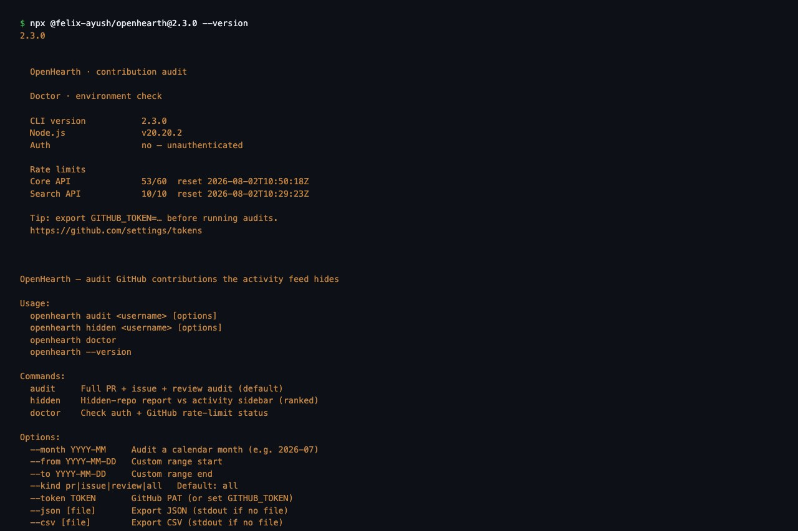

# OpenHearth

[](https://www.npmjs.com/package/@felix-ayush/openhearth)
[](./LICENSE)
[](https://nodejs.org)
[](https://ayush7614.github.io/OpenHearth/)

**CLI + browser workspaces** to audit every GitHub PR, issue, and review — including repos hidden from your activity feed (“N repositories not shown”).

**Website:** [ayush7614.github.io/OpenHearth](https://ayush7614.github.io/OpenHearth/) · **npm:** [`@felix-ayush/openhearth`](https://www.npmjs.com/package/@felix-ayush/openhearth)

<p align="center">
  
</p>

## Product

| Landing & docs | Workspace detail | Multi-user board | CLI |
| --- | --- | --- | --- |
|  |  |  |  |

- **Workspaces** — create a space per GitHub user, run audits, save months, chart trends, share reports, import CLI JSON  
- **Board** — compare multiple users side by side with month-over-month deltas  
- **CLI** — same audit engine in your terminal (`audit`, `hidden`, `doctor`)

## Why OpenHearth?

GitHub’s profile activity truncates heavily (“51 repositories not shown”). Search shows lists; **OpenHearth audits** — with features that don’t exist elsewhere:

- **Ranked hidden repos** — lower-activity repos past the ~25 sidebar cap
- **Full audit** — PRs + issues + reviews in one command
- **Doctor + rate-limit UX** — clear fix hints when GitHub throttles you
- **GitHub Action** — monthly/on-demand audits with JSON/CSV artifacts
- **Auto date-splitting** — past GitHub’s 1000-result search cap
- **JSON / CSV export**

## Install & run (CLI)

```bash
# Quick start (no install)
npx @felix-ayush/openhearth audit Ayush7614 --month 2026-07
npx @felix-ayush/openhearth hidden Ayush7614 --month 2026-07
npx @felix-ayush/openhearth doctor

# Global install
npm install -g @felix-ayush/openhearth
openhearth audit Ayush7614 --month 2026-07

# From this repo (development)
npm install
npm run build:cli
npm run openhearth -- audit Ayush7614 --month 2026-07
```

Set `GITHUB_TOKEN` for higher rate limits.

### Commands

| Command | Description |
|---------|-------------|
| `openhearth audit <user>` | Full PR + issue + review audit |
| `openhearth hidden <user>` | Ranked likely-hidden repos |
| `openhearth doctor` | Auth + rate-limit check |
| `--month YYYY-MM` | Audit a calendar month |
| `--from` / `--to` | Custom date range |
| `--kind pr\|issue\|review\|all` | Filter by type |
| `--json [file]` | Export JSON |
| `--csv [file]` | Export CSV |
| `-V, --version` | Print CLI version |

### GitHub Action

- In this repo: `.github/workflows/audit.yml`
- **For any other repo:** copy [`docs/github-action-template.yml`](docs/github-action-template.yml)

### Releases

Tagged releases (`v*`) create a **GitHub Release** via `.github/workflows/release.yml` (tests + build + notes from `CHANGELOG.md`).  
Optional npm publish when the `NPM_TOKEN` secret is set.

```bash
# After merging to main
git tag v2.3.0
git push origin v2.3.0
```

See [CHANGELOG.md](CHANGELOG.md).

## Website (docs + workspaces)

```bash
npm run dev:site    # local marketing/docs + workspace UI
npm run build:site  # builds site/dist for GitHub Pages
```

Open [ayush7614.github.io/OpenHearth/#/app](https://ayush7614.github.io/OpenHearth/#/app) for workspaces (demo data loads on first visit).

### CLI → UI

```bash
npx @felix-ayush/openhearth audit USER --month 2026-07 --json report.json
# then drop report.json on the Workspaces page (or inside a workspace)
```

## Monorepo layout

```
packages/core/   Internal audit engine (bundled into the CLI — not published)
packages/cli/    @felix-ayush/openhearth — the only npm package users should install
site/            Marketing, docs & browser workspaces (GitHub Pages)
docs/            Images + GitHub Action template for other repos
```

> Note: an early `@felix-ayush/openhearth-core` publish was removed from npm.  
> Install `@felix-ayush/openhearth` only.

## Publish CLI to npm

```bash
npm run publish:packages
```

## Author

**Ayush Kumar**

- GitHub: [github.com/Ayush7614](https://github.com/Ayush7614)
- LinkedIn: [linkedin.com/in/ayush-kumar-cse](https://www.linkedin.com/in/ayush-kumar-cse)

## License

MIT
